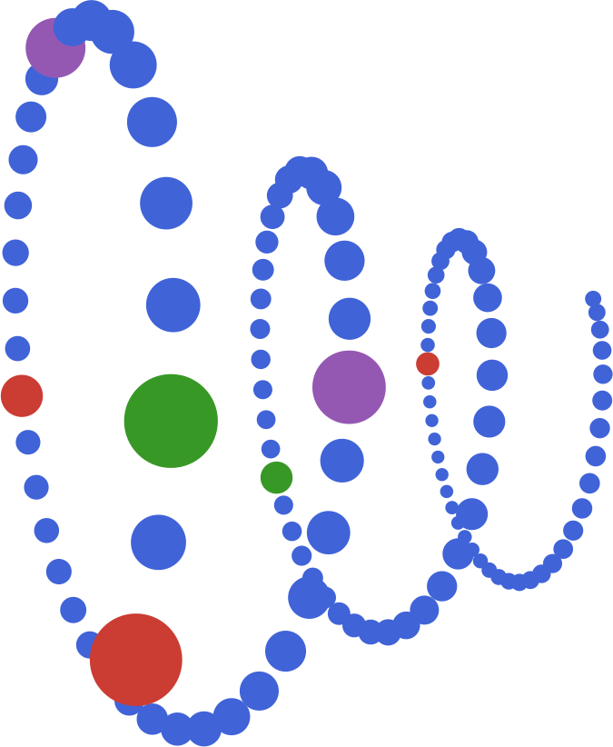

# ElemCo.jl  <br/> <span style="font-weight:normal"> *elemcoil*</span><br/>

Julia implementation of various electron-correlation methods (main focus on coupled cluster methods).
The integrals are obtained from a FCIDUMP file or calculated using an interface to [libcint](https://github.com/sunqm/libcint).

## Capabilities

| Class           | Methods                               |
|-----------------|---------------------------------------|
| Mean-field      | DF-HF, DF-UHF, BO-HF, BO-UHF, DF-MCSCF|
| Perturbative    | DF-MP2, MP2, UMP2, SOS-LT-DF-MP2      |
| Coupled Cluster | CCSD, RCCSD, UCCSD, DCSD, RDCSD, UDCSD, CCSD(T), RCCSD(T), UCCSD(T), ΛCCSD(T), ΛUCCSD(T), FR-CCSD, FR-DCSD, 2D-CCSD, 2D-DCSD, CCSDT, UCCSDT, DC-CCSDT, UDC-CCSDT, FR-CCSDT, FR-DC-CCSDT, SVD-DF-DCSD, SVD-DC-CCSDT          |
| CI              | FCI, CIPHI                            |
| DMRG            | `ITensors.jl` interface               |
| Excited states  | EOM-CCSD, EOM-DCSD, EOM-UCCSD, EOM-RCCSD, EOM-UDCSD, EOM-RDCSD, FCI, CIPHI  |

## Getting started

Requirements: julia (>1.9)

## Usage

### Installation

To install `ElemCo.jl`, run the following command in the Julia REPL,

```julia
julia> using Pkg
julia> Pkg.add("ElemCo")
```

For a development version of `ElemCo.jl`, clone the [ElemCo.jl-devel](https://github.com/fkfest/ElemCo.jl-devel) repository and create an alias to set the project to the `ElemCo.jl` directory,

```bash
alias jlm='julia --project=<path_to_ElemCo.jl>'
```

Start `jlm` in the terminal and run the following command to install the dependencies,

```julia
julia> using Pkg
julia> Pkg.instantiate()
```

Now the command `jlm` can be used to start the calculations,

```bash
jlm input.jl
```

### Input file

The input file is a Julia script that contains the calculation details. The script should start with the following lines,

```julia
using ElemCo
@print_input
```

The `@print_input` macro prints the input file to the standard output. The calculation details are specified using the macros provided by `ElemCo.jl`.

### Macros

The following macros are available in `ElemCo.jl` (see [the documentation for more details and macros](https://elem.co.il/stable/elemco/)),

- `@hf` / `@uhf` - Performs a Hartree-Fock calculation using exact (non-density-fitted) AO integrals,
- `@dfhf` - Performs a density-fitted Hartree-Fock calculation,
- `@cc <method>` - Performs a coupled cluster calculation,
- `@dfcc <method>` - Performs a coupled cluster calculation using density-fitted integrals in the correlation treatment,
- `@ints` - Generates the exact AO integral files (done automatically by `@hf`/`@uhf`),
- `@dfints` / `@moints` - Generates a persistent MO integral set (density-fitted / from the exact AO integrals),
- `@set <option> <setting>` - Sets the options for the calculation,

etc.

Default scratch directory path on Windows is the first environment variable found in the ordered list `TMP`, `TEMP`, `USERPROFILE`.
On all other operating systems `TMPDIR`, `TMP`, `TEMP`, and `TEMPDIR`. If none of these are found, the path `/tmp` is used.
Default scratch folder name is `elemcojlscr`.

Variable names `fcidump`, `geometry` and `basis` are reserved for the file name of FCIDUMP, geometry specification and basis sets, respectively.

### Input generation and orbital visualizer

`ElemCo.jl` input files can be generated using [`jlmol`](https://github.com/fkfest/jlmol),
which can also be used to visualize the molecular orbitals.
The browser version of `jlmol` can be found at [app.jlmol.com](https://app.jlmol.com).

### Example

#### DCSD calculation using integrals from a FCIDUMP file

The ground state energy can be calculated using the DCSD method with the following script:

```julia
using ElemCo
@print_input
fcidump = "../test/H2O.FCIDUMP"
@cc dcsd
```

#### DCSD calculation of the water molecule using exact (non-DF) integrals

The ground state energy of the water molecule with the DCSD method, using the exact
four-index AO integrals throughout:

```julia
using ElemCo
@print_input
geometry="bohr
     O      0.000000000    0.000000000   -0.130186067
     H1     0.000000000    1.489124508    1.033245507
     H2     0.000000000   -1.489124508    1.033245507"

basis = "vdz"
@hf
@cc dcsd
```

The `@hf` macro generates the exact AO integrals (as `@ints` would) and calculates the
Hartree-Fock energy and orbitals from them; the correlated calculation then runs
**AO-direct** -- the MO integrals are never formed. `@uhf` is the unrestricted counterpart.

#### DCSD calculation using density-fitted integrals

The same calculation with density fitting:

```julia
using ElemCo
@print_input
geometry="bohr
     O      0.000000000    0.000000000   -0.130186067
     H1     0.000000000    1.489124508    1.033245507
     H2     0.000000000   -1.489124508    1.033245507"

basis = "vdz"
@dfhf
@cc dcsd
```

The `@dfhf` macro calculates the density-fitted Hartree-Fock energy and orbitals
and then the DCSD calculation is performed using density-fitted integrals.

#### Which integrals does a calculation use?

The correlated methods follow the integrals of the reference:

- `@hf` (or `@uhf`) + `@cc` -- exact AO integrals; most methods (MP2, CCSD/DCSD and
  variants, (T), Lambda/properties, EOM, SVD-DC-CCSDT) run **AO-direct**, without ever
  forming an MO integral set. (SVD-DC-CCSDT works from 3-index triples
  intermediates: by default density-fitted, needing an `"mpfit"` basis; with
  `@set cc usedf=false` the exact integrals are Cholesky-decomposed instead -- fit-free,
  on either route.)
- `@dfhf` + `@cc` -- density-fitted integrals: the MO integrals are generated **on the fly**
  inside the correlated calculation and **deleted** when it finishes (they depend on the
  orbitals, so a stale set must never be silently reused). If several calculations should
  reuse one MO integral set, generate it explicitly with `@dfints` (or `@moints` for the
  exact-AO counterpart) -- an explicitly created set persists and is yours to refresh.
- `fcidump = "..."` + `@cc` -- integrals from the FCIDUMP file.
- After `@dfhf`, the exact-AO route can still be requested with `@ints` before `@cc`
  (or `@set int df=false` to make it the default for new calculations); conversely
  `@set int ao_direct=false` routes an exact-AO calculation through a derived MO dump.

Every correlated run prints one line stating which integrals it uses.

Various [options](https://elem.co.il/stable/options/) can be set using the `@set` macro. It is advisable to set options locally for each calculation to avoid unintended side effects. For example, to change the convergence threshold of the Hartree-Fock calculation to `1e-8`, the following line can be added before the `@dfhf` macro:

```julia
@set scf thr=1e-8
```

or locally for the `@dfhf` macro as:

```julia
@dfhf begin
  @set scf thr=1e-8
end
```

Further example scripts are provided in the `examples` directory.

### Precompilation

`ElemCo.jl` uses `PrecompileTools.jl` to reduce time-to-first-execution.
By default the coupled cluster and FCI workloads are precompiled in release builds.
You can select which parts of the code to precompile using the `Preferences.jl` mechanism
by editing `LocalPreferences.toml` in the project directory:

```toml
[ElemCo]
precompile_workload = true   # master toggle (default: true for releases, false for development builds)
precompile_cc = true          # coupled cluster methods (DCSD, UCCSD, SVD-DCSD, MP2)
precompile_fci = true         # FCI
precompile_mcscf = false      # DF-MCSCF
precompile_complex = false    # complex-valued calculations
```

Alternatively, preferences can be set from the Julia REPL:

```julia
using Preferences, ElemCo
set_preferences!(ElemCo,
                 "precompile_workload" => true,
                 "precompile_cc" => true,
                 "precompile_fci" => true,
                 "precompile_mcscf" => true;
                 force=true)
```

To disable all precompilation (e.g. during development):

```toml
[ElemCo]
precompile_workload = false
```

It is also recommended to [activate the precompilation](https://quantumkithub.github.io/TensorOperations.jl/stable/man/precompilation) in the `TensorOperations` module to reduce
the precompilation time of `ElemCo.jl`.

Documentation is available at <https://elem.co.il>.

```
Electron coil
A poem by Bing

In the heart of an atom lies a tiny core
Where protons and neutrons are tightly bound
But around this nucleus, there's so much more
A cloud of electrons that swirls around

They don't orbit in circles like planets do
But jump and spin in quantum states
They can be here and there and everywhere too
And sometimes they even change their mates

This is the electron coil, the turmoil of the shell
The source of light and heat and power
The force that makes the atoms repel or gel
The spark that ignites the cosmic flower
```
